# Lupa

Analizador y corrector de código para quien empieza a programar: marca los errores de Java, Python, JavaScript, C y SQL, los explica en español, propone la corrección, ejecuta el código, tiene ejercicios que se comprueban solos y un paso a paso para ver cómo cambian las variables. Proyecto de 2º DAM (IES Torre del Rey).

**Web:** [pablopozocamp.github.io/Lupa-App](https://pablopozocamp.github.io/Lupa-App/)

## Descargar

En [Releases](https://github.com/pablopozocamp/Lupa-App/releases/latest):

- **Windows:** `Lupa-windows.zip`. Descomprímelo y abre `Lupa.exe`. Lleva Java dentro: no hace falta instalar nada.
- **macOS o Linux:** `Lupa.jar`. Necesitas Java 21 o más nuevo: `java -jar Lupa.jar`.

Si Windows avisa con «Windows protegió su PC», pulsa «Más información» y «Ejecutar de todas formas» (la app aún no está firmada).

## Historial de versiones

Todo lo que ha ido cambiando en Lupa, de la versión más nueva a la más antigua. Las descargas de cada versión publicada están en [Releases](https://github.com/pablopozocamp/Lupa-App/releases).

### Versión 0.18.0 (aviso de actualizaciones)

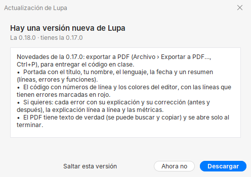

Novedad de la 0.18.0: **Lupa avisa cuando hay una versión nueva**. Al abrirse mira en GitHub cuál es la última versión publicada y, si es más nueva, enseña una ventana con lo que trae y tres botones:

- **Descargar**: la descarga en la carpeta de Descargas con una barra de progreso (se puede cancelar). Si Lupa se abrió con `Lupa.exe` descarga `Lupa-windows.zip`; si se abrió con el jar, `Lupa.jar`. Al terminar dice cómo abrir la versión nueva y deja abrir la carpeta. La descarga se guarda primero con otro nombre y se renombra al acabar, así que nunca queda un archivo a medias.
- **Ahora no**: se vuelve a avisar otro día.
- **Saltar esta versión**: no se vuelve a avisar de esa versión al abrir.

Para no molestar: se mira como mucho una vez al día, en segundo plano, y el aviso espera a que no haya otra ventana encima (la bienvenida, la de recuperar lo no guardado…). Sin conexión no pasa nada. Lo único que se envía es la consulta a la API pública de GitHub: nada del usuario ni de su código.

Nuevo menú **Ayuda**: **Buscar actualizaciones…** (siempre dice algo: si hay versión nueva, si ya tienes la última o si no hay conexión) y la casilla **Buscar actualizaciones al abrir Lupa**, para quitarlo.

1192 pruebas en verde (4 nuevas): se lee una respuesta de GitHub, se comparan versiones número a número (la 0.18 es más nueva que la 0.9) y se descarga de un servidor de prueba en el propio equipo, también cancelando.

### Versión 0.17.0 (exportar a PDF)

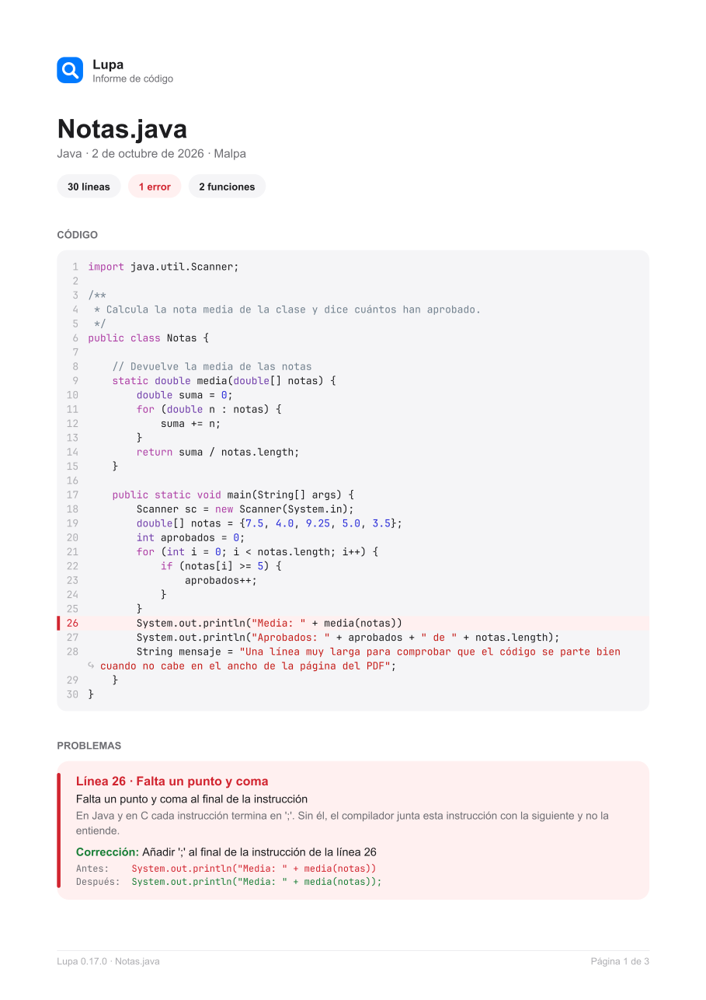

Novedad de la 0.17.0: **Archivo › Exportar a PDF… (Ctrl+P)**. Crea un PDF con el código para entregarlo en clase, con el mismo estilo limpio de Lupa:

- **Portada**: el logotipo, el título (el nombre de la pestaña, que se puede cambiar), el lenguaje, la fecha y el nombre de quien lo entrega (se recuerda para la próxima vez), con un resumen: cuántas líneas, cuántos errores y cuántas funciones.
- **El código** con números de línea y los mismos colores que el editor, en la letra JetBrains Mono. Las líneas con errores van marcadas en rojo, y las que no caben en el ancho de la hoja se parten por un espacio y siguen debajo con «↪».
- **Problemas** (si se quiere): cada error con su línea, su explicación y, si Lupa sabe arreglarlo, la corrección con la línea de antes y la de después. Si no hay errores, lo dice en verde.
- **Explicación línea a línea** (si se quiere): cada línea o bloque con su código y lo que hace, sangrado según lo que va dentro de qué.
- **Métricas** (si se quiere): líneas de código, porcentaje de comentarios, funciones, complejidad media y los consejos.
- Pie en cada página con el título y «Página 2 de 5». Al terminar, el PDF se abre solo.

El PDF se crea con **Apache PDFBox** (licencia Apache 2.0). El texto va en Helvetica, que tienen todos los lectores de PDF y que trae las tildes, la ñ, «», ¿ y ¡; el código va en JetBrains Mono, metida dentro del PDF, y cualquier carácter que no esté en Helvetica (una flecha, un símbolo) se escribe con ella. El PDF tiene texto de verdad: se puede buscar y copiar.

1188 pruebas en verde (7 nuevas): se exporta cada plantilla de los cinco lenguajes, un archivo largo de varias páginas con emojis y símbolos, y se vuelve a leer el PDF para comprobar lo que dice.

### Versión 0.16.0 (paso a paso en JavaScript y C)

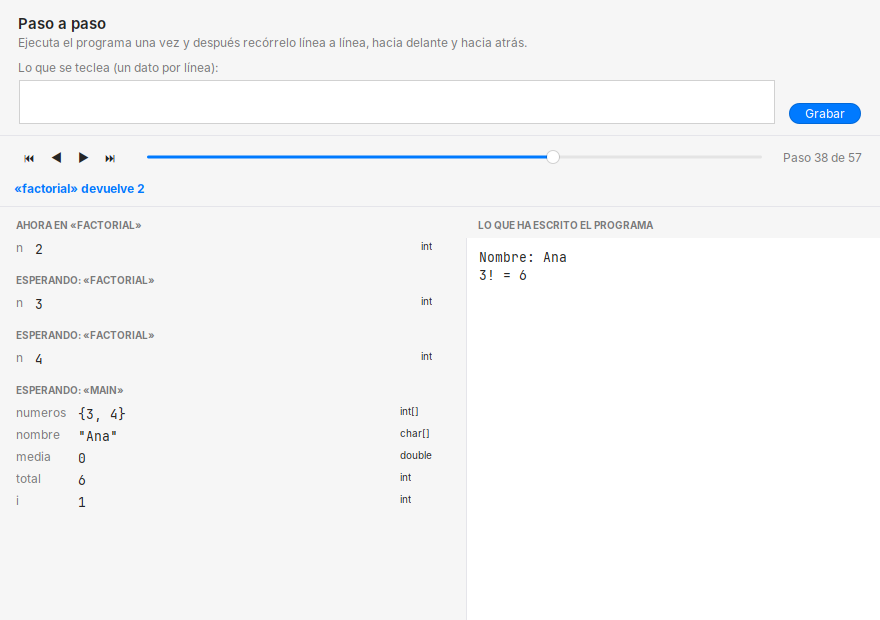

Novedad de la 0.16.0: **el paso a paso ya funciona en los cinco lenguajes**, como Ejecutar y Probar. Igual que en Java, Python y SQL: el editor marca la línea, se ven las variables de cada llamada en marcha (con las recursivas esperando cada una con su valor), lo que devuelve cada función y lo que el programa ha escrito hasta ese paso.

- **JavaScript**: Lupa lee el programa con **acorn** (un analizador de JavaScript muy usado, licencia MIT, que va dentro de Lupa) y, antes de cada instrucción, mete una llamada que apunta la línea y las variables que se ven desde ahí. Las funciones (también las flechas y los métodos de las clases) avisan al entrar y al salir, y cada `return` dice qué devuelve. Después lo ejecuta con Node.js o con el QuickJS incluido. `prompt()` usa lo que se escribe en «Lo que se teclea».
- **C**: como no hay un depurador que se pueda llevar dentro, Lupa hace lo mismo con su propio lector de C: antes de cada instrucción apunta la línea y escribe cada variable según su tipo (enteros, decimales, caracteres como `'a' (97)`, textos `char nombre[20]`, arrays de números como `{3, 4}` y punteros con su dirección, sin mirar dentro). Lo que escribe `printf` se guarda, y lo que lee `scanf` sale en la salida como en una terminal. Se compila con el gcc del equipo o con el TinyCC incluido.
- En C, si el programa falla (una división entre cero, un array fuera de su tamaño, una recursividad sin fin), la grabación se guarda igual y el último paso dice qué ha pasado y en qué línea.

Para comprobar que no rompe nada, se graba paso a paso todo el código de C y JavaScript que trae Lupa: las plantillas, las soluciones de los ejercicios y el banco de fragmentos.

1181 pruebas en verde (6 nuevas).

### Versión 0.15.0 (paso a paso)

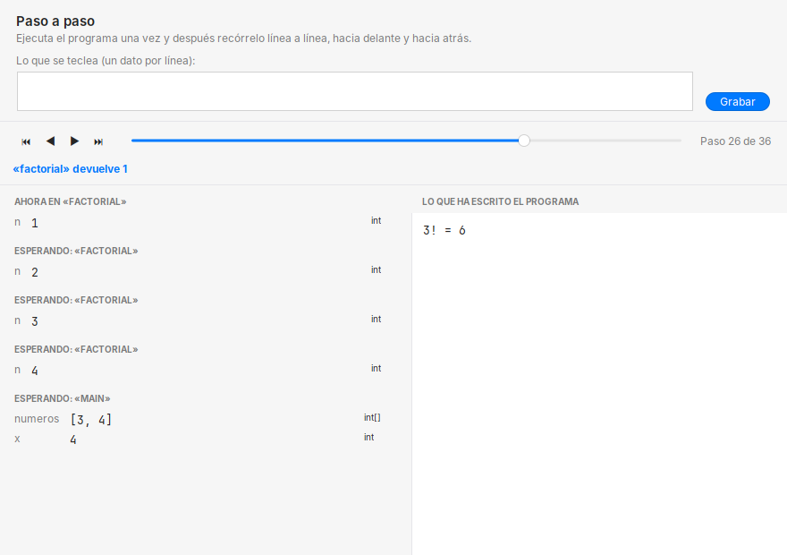

Novedad de la 0.15.0: **el paso a paso** (Ejecutar › Paso a paso…, **Mayús+F5**). Al pulsar **Grabar**, Lupa ejecuta el programa una vez apuntando cada línea; después se puede recorrer con calma, **hacia delante y hacia atrás** (botones, barra o flechas del teclado):

- El editor marca la línea que se va a ejecutar.
- A la izquierda salen las variables de cada llamada en marcha, la más reciente arriba. Las que acaban de aparecer o de cambiar van en azul. En una función recursiva se ve cada llamada esperando con su propio valor (`factorial` con `n = 1`, debajo la de `n = 2`, la de `n = 3`… y el `main`).
- Cuando una función termina se dice qué devuelve («factorial devuelve 6»), y al final, «Fin del programa» o el error con su línea.
- A la derecha, lo que el programa había escrito justo hasta ese paso.
- Lo que el programa lee del teclado (`Scanner`, `input()`) se escribe antes de grabar, un dato por línea.

Funciona en **Java**, **Python** y **SQL**:

- **Java**: Lupa compila el programa con `-g` y lo lanza en modo depuración, conectándose con la **JDI**, la interfaz de depuración del JDK (la misma que usan los IDE). Se para antes de cada línea del código del alumno, sin meterse en las clases de Java. Lee las variables locales, los atributos de `this`, los arrays, las `ArrayList` y los objetos de las clases del alumno (`Persona{nombre="Ana", edad=20}`).
- **Python**: un pequeño script con `sys.settrace`, lo mismo que usan los depuradores de Python.
- **SQL**: sentencia a sentencia, enseñando cómo están todas las tablas antes de cada una.

Para no colgarse, se dejan de grabar a los 1000 pasos (y en Java, si una línea se queda dando vueltas sin avanzar). JavaScript y C llegarán en otra versión.

También en esta versión:

- **Lupa.exe se crea de nuevo con jpackage** (script en `crear-windows.ps1`): lleva el icono de Lupa en vez del de Java, su versión en Propiedades › Detalles y el depurador de Java para el paso a paso. Además ocupa menos (unos 79 MB).
- Saltos de línea: el repositorio tiene `.gitattributes` con saltos de línea de Linux, y las pruebas que leen archivos ya no fallan al descargar el proyecto en Windows.

1175 pruebas en verde (15 nuevas), ya sin ningún fallo en Windows.

### Versión 0.14.0 (ejercicios que se comprueban ejecutándolos)

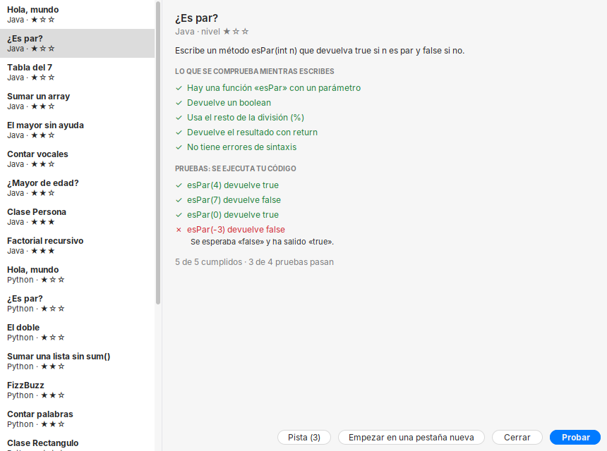

Novedad de la 0.14.0: **los ejercicios ya no se conforman con mirar el código: lo ejecutan**. Cada uno de los 23 ejercicios trae sus casos de prueba y la ventana de ejercicios tiene un botón **Probar** que ejecuta el código del editor con cada caso, en los cinco lenguajes, y marca cuáles pasan (✓ en verde) y cuáles no (✗ en rojo, con el porqué debajo: «Se esperaba «false» y ha salido «true».»). **El ejercicio solo cuenta como conseguido si se cumplen los requisitos y pasan todas las pruebas** con el código que hay en el editor; si lo cambias, las pruebas vuelven a quedar sin probar.

- **Funciones** (`esPar`, `sumar`, `maximo`, `factorial`, `es_par`, `doble`…): Lupa añade al código una llamada a la función con otros valores (`esPar(-3)`, `sumar({})`, `maximo({-4, -2, -8})`…) y compara lo que devuelve. Así se pillan los fallos típicos: el resto con números negativos, el array vacío, empezar el máximo en 0… En Java la llamada va en una clase aparte que se ejecuta antes que la del alumno; en C se renombra su `main`.
- **Programas** («Hola, mundo», la tabla del 7, FizzBuzz, el Scanner de la edad, el doble con `input()`…): se ejecuta el programa entero, se le teclean los datos de la prueba (20, 18, 15…) y se mira lo que escribe.
- **SQL**: se crean unas tablas `clientes` y `productos` con datos de ejemplo, se ejecutan la consulta del alumno y la de la solución y tienen que dar las mismas filas (los nombres de las columnas no cuentan; el orden de las filas, solo si la solución usa `ORDER BY`). La segunda prueba usa otros datos, para que no valga escribir el resultado a mano.
- Las pruebas usan lo mismo que el botón Ejecutar (con Python, QuickJS y TinyCC incluidos en Windows), cada una con un tiempo máximo, así que un bucle sin fin no bloquea nada.

1160 pruebas (38 nuevas): entre ellas, que la solución de cada ejercicio pasa todas sus pruebas y que el código de inicio no.

### Versión 0.13.0 (análisis de sintaxis de JavaScript, C y SQL)

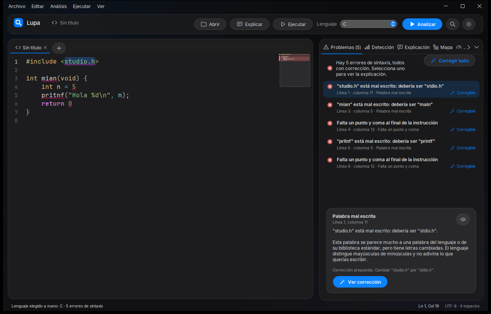

Novedad de la 0.13.0: **la pestaña Problemas ya busca errores de sintaxis en los cinco lenguajes**. Hasta ahora solo lo hacía en Java y Python; en JavaScript, C y SQL decía «llegará en una versión posterior». Igual que en Java y Python, cada error sale subrayado en el editor, con su explicación en español y, si está en el catálogo, con su corrección (y **Corregir todo**). El modo ejercicio también comprueba ya «No tiene errores de sintaxis» en los cinco lenguajes.

- **C** (analizador propio): comillas sin cerrar, llaves, paréntesis y corchetes desemparejados, **falta el punto y coma** (también el `};` de un `struct`, o el de un `do … while`), `return` fuera de una función, `if`/`while`/`for`/`switch` sin paréntesis, `#include` sin `< >` y palabras mal escritas (`pritnf`, `scnaf`, `mian`, `#inlcude`, `studio.h`…). Sabe que una lista `{1, 2, 3}`, un `enum` o una macro de varias líneas no llevan punto y coma dentro.
- **JavaScript** (analizador propio): comillas sin cerrar (también las plantillas con `` ` ``, que sí pueden ocupar varias líneas), delimitadores, `return` fuera de una función (distingue las funciones, las flechas `=>` y los métodos de una clase de los bloques de un `if` o un `for`), condiciones sin paréntesis y palabras mal escritas (`consloe`, `fucntion`, `lenght`…). Entiende las expresiones regulares (`/a+b/gi`). El punto y coma no se exige, porque en JavaScript es opcional.
- **SQL**: primero un repaso propio (comillas, paréntesis, palabras clave mal escritas como `SELCT` o `FORM` y **sentencias a las que les falta el `;`** antes de la siguiente) y después **JSqlParser**, un analizador de SQL completo que entiende MySQL. Sus avisos se cuentan en español: «Sobra esta coma: detrás de la última columna, antes de FROM, no va coma», «Falta una coma entre las columnas», «Falta algo detrás de «WHERE»», «Falta el valor detrás del '='»…

Para no inventarse errores, los tres se prueban con todo el código correcto que tiene Lupa: las plantillas, las soluciones de los ejercicios, el banco de fragmentos y el código que escribe el autocompletado (46 intenciones de JavaScript, 30 de C y 10 de SQL). En ninguno sale un aviso.

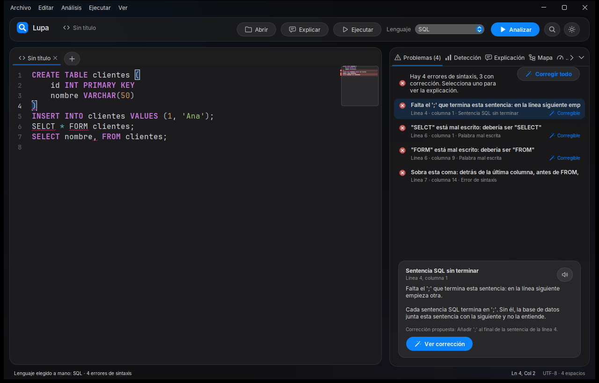

1122 pruebas en verde (102 nuevas).

### Versión 0.12.2 (Python también incluido: nada que instalar)

Novedad de la 0.12.2: **en Windows ya no hay que instalar nada para ejecutar ninguno de los cinco lenguajes**. Lupa lleva también dentro **Python 3.14.8**, la distribución «embeddable» oficial de python.org (licencia PSF), con toda la biblioteca estándar: `math`, `random`, `json`, `datetime`, `sqlite3`… Igual que con C y JavaScript, si el equipo ya tiene Python instalado se usa ese, y el incluido es el plan B. No trae `tkinter` (y por tanto tampoco `turtle`) ni `pip`.

Las tres herramientas incluidas ocupan unos 14 MB comprimidas dentro de Lupa y se descomprimen la primera vez que hacen falta en `.lupa/herramientas`.

| Lenguaje | ¿Hay que instalar algo en Windows? |
|---|---|
| Java | No (va el JDK de Lupa) |
| Python | No (Python 3.14.8 incluido) |
| JavaScript | No (QuickJS incluido) |
| C | No (TinyCC incluido) |
| SQL | No (H2 incluido) |

1020 pruebas en verde (1 nueva: el Python incluido, con `input()`, tildes y un error con su línea).

### Versión 0.12.1 (C y JavaScript sin instalar nada)

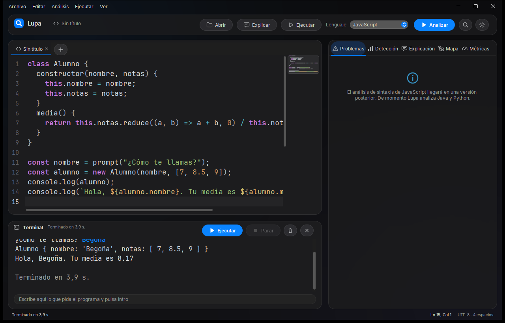

Novedad de la 0.12.1: **en Windows ya no hay que instalar ningún compilador para ejecutar C ni JavaScript**. Lupa lleva dentro dos herramientas muy pequeñas, que juntas ocupan poco más de 1 MB comprimidas:

- **TinyCC** 0.9.27 (`tcc`), un compilador de C (licencia LGPL 2.1). Compila y ejecuta con `stdio.h`, `math.h`, `stdbool.h`, `scanf`… y los errores salen con su línea, como con gcc.
- **QuickJS-ng** 0.17.0 (`qjs`), un motor de JavaScript moderno (licencia MIT), con clases, funciones flecha, plantillas de texto, `Map`, `Set`… Lupa le añade `prompt()`, `alert()` y `confirm()`, y hace que `console.log` enseñe las listas y los objetos como Node: `[ 1, 4, 9 ]`, `Alumno { nombre: 'Begoña', notas: [ 7, 8.5, 9 ] }`.

La primera vez que hacen falta se descomprimen en `.lupa/herramientas` de la carpeta personal. **Si el equipo ya tiene gcc, clang o Node.js, Lupa sigue usándolos**, porque son más completos; las incluidas son el plan B para que Ejecutar funcione siempre. En macOS y Linux (con `Lupa.jar`) se usan los que haya instalados.

1019 pruebas en verde (5 nuevas). Las he pasado dos veces: sin Node ni gcc en el equipo (como lo tendrá casi todo el mundo) y con ellos instalados.

### Versión 0.12.0 (ejecutar los cinco lenguajes)

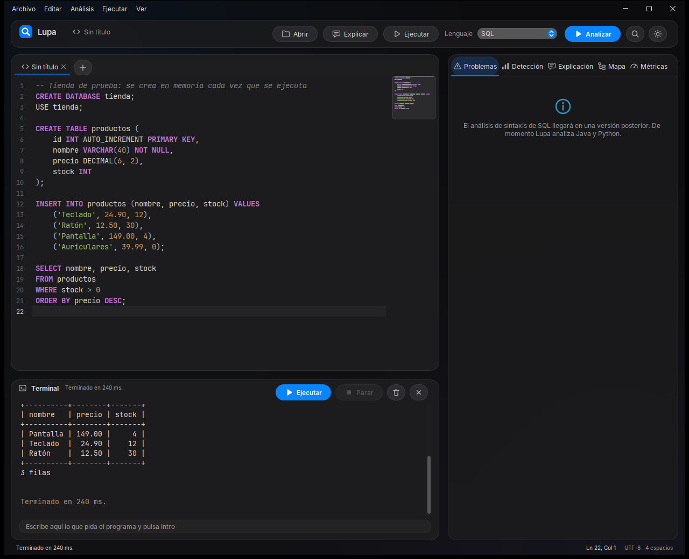

Novedad de la 0.12.0: **Ejecutar ya funciona con los cinco lenguajes de Lupa**. A Java y Python se suman JavaScript, C y SQL, con el mismo botón (**Ctrl+F5**), la misma terminal y los mismos límites (60 segundos, un millón de caracteres y el botón **Parar**).

- **SQL** funciona sin instalar nada. Lupa lleva dentro una base de datos de prueba (H2) en **modo compatible con MySQL**, así que `AUTO_INCREMENT`, `VARCHAR`, `LIMIT`, `CREATE DATABASE`, `USE`, `SHOW TABLES` o `DESCRIBE` funcionan como en clase. La base de datos empieza vacía cada vez y desaparece al terminar, así que no se puede estropear ninguna de verdad.
  - Las consultas salen como tablas, igual que en el cliente de MySQL, con los números alineados a la derecha y «3 filas» debajo. El resto de sentencias dicen lo que han hecho: «Tabla productos creada.», «4 filas añadidas.», «2 filas borradas.».
  - Si una sentencia falla, Lupa dice **en qué línea** y **por qué, en español**, y se para ahí: «Error en la línea 12: no existe la tabla «cliente». ¿Está bien escrita? ¿La has creado antes con CREATE TABLE?». También explica las claves repetidas, los `NOT NULL`, las claves ajenas, los textos demasiado largos y los errores de sintaxis (enseñando dónde se ha perdido).
- **JavaScript** se ejecuta con **Node.js** (`node programa.js`). Para que funcione el código de clase, Lupa añade `prompt()`, `alert()` y `confirm()` como en el navegador: `prompt("¿Cómo te llamas?")` pregunta en la terminal y espera a que se escriba la respuesta. Los errores salen con la línea del archivo del alumno.
- **C** se compila con **gcc** (o clang) y, si no hay errores, se ejecuta, todo con un solo Ejecutar. Los errores del compilador salen en rojo con su línea, y debajo, «No se ha podido compilar: corrige los errores de arriba». Los `printf` sin `\n` (las preguntas antes de un `scanf`) se ven en el momento, y `math.h` funciona sin añadir nada.
- Si falta Node o gcc, la terminal lo dice y explica cómo instalarlo (nodejs.org; MSYS2 para gcc en Windows). Además de buscarlos en el PATH, Lupa mira las carpetas donde suelen quedar al instalarlos (`C:\Program Files\nodejs`, `C:\msys64`, `C:\MinGW`, Code::Blocks, w64devkit, LLVM…), porque muchas veces no se añaden al PATH.

| Lenguaje | Cómo se ejecuta | ¿Hay que instalar algo? |
|---|---|---|
| Java | `java Hola.java`, con el JDK de Lupa | No |
| Python | `py -3`, `python3` o `python` | Python 3 |
| JavaScript | `node programa.js` o, si no hay Node, el QuickJS incluido (v0.12.1) | No (en Windows) |
| C | `gcc programa.c` y luego el programa o, si no hay gcc, el TinyCC incluido (v0.12.1) | No (en Windows) |
| SQL | base de datos H2 en memoria, modo MySQL | No |

1014 pruebas en verde (13 nuevas). Las de JavaScript y C se saltan solas si el equipo no tiene Node o gcc; las he pasado con Node 22 y gcc 16 y no se ha saltado ninguna.

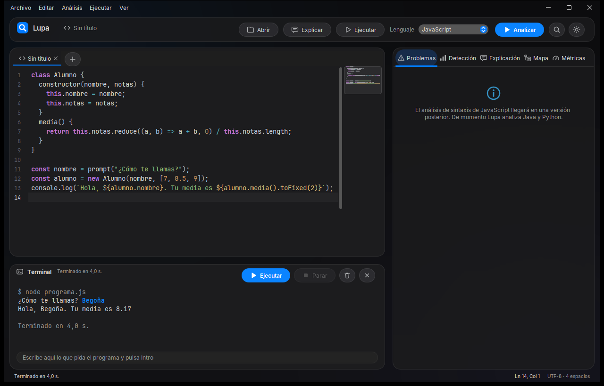

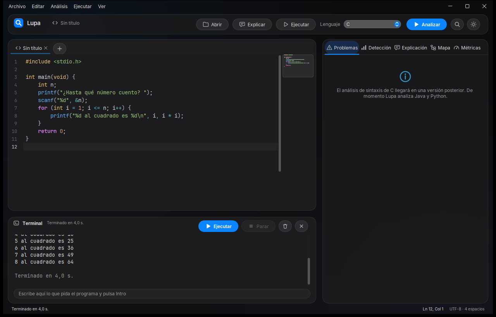

### Versión 0.11.0 (ejecutar Java y Python)

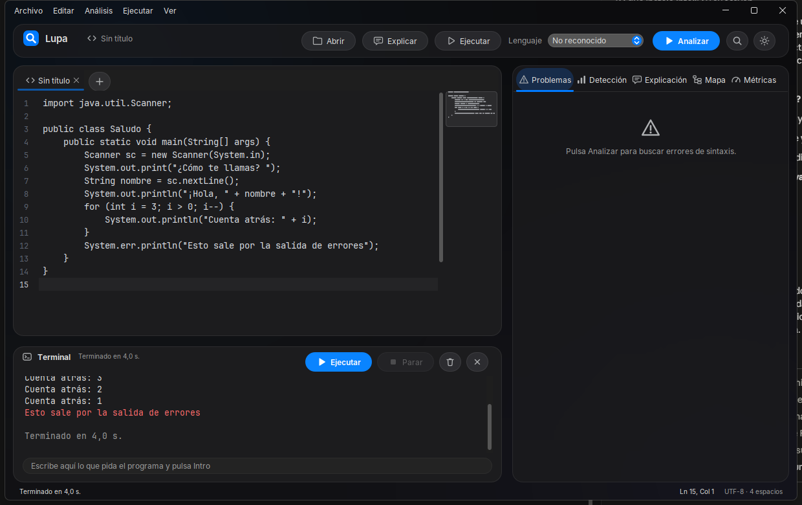

Novedad de la 0.11.0: **Lupa ya puede ejecutar el código**, de momento **Java y Python**.

- **Ejecutar** (botón de la cabecera, menú **Ejecutar** o **Ctrl+F5**) abre la **Terminal** debajo del editor y lanza el código. Los programas de Java se lanzan con `java Hola.java` (el archivo se llama como la clase pública, como exige Java). Para Python se usa el que tengas instalado (`py -3`, `python3` o `python`).
- La terminal enseña lo que escribe el programa, con los **errores en rojo** (también los de compilación de Java). Si el programa pide algo (`Scanner`, `input()`), se escribe en la caja de abajo y se pulsa **Intro**. Lo que tecleas sale en azul.
- **Parar** (**Ctrl+F2**) corta el programa. Además, Lupa lo para sola si tarda **más de 60 segundos** o si escribe sin parar (más de un millón de caracteres: casi seguro un bucle infinito), y explica por qué.
- Al terminar dice cómo ha ido: «Terminado en 0,4 s» o «Terminado con error (código 1)». **Alt+F12** enseña o esconde la terminal. Su letra sigue al zoom del código.
- Si no hay Python, lo dice y explica cómo instalarlo. El acceso directo de la Microsoft Store que trae Windows (se llama `python` pero solo abre la tienda) no se confunde con un Python de verdad.
- JavaScript, C y SQL se reconocen pero todavía no se ejecutan; la terminal lo avisa.

**Excepción a RN-05.** Hasta ahora Lupa no ejecutaba nunca el código. La terminal es la única excepción, y está acotada: solo se ejecuta cuando el usuario pulsa Ejecutar, en una carpeta temporal que se borra al terminar, con límite de tiempo y de salida, y sin que el código salga del equipo. El análisis, la detección y las correcciones siguen siendo solo estáticos.

1001 pruebas en verde (16 nuevas). La de Python se salta sola si el equipo no tiene Python.

### Versión 0.10.0 (recuperar lo no guardado)

Novedad de la 0.10.0: **si Lupa se cierra de golpe, no se pierde lo que no estaba guardado**.

- Mientras trabajas, cada 5 segundos (solo si algo ha cambiado), Lupa guarda una copia de las pestañas con cambios sin guardar en `.lupa/recuperacion` de tu carpeta personal. Se escribe en otro hilo, así el editor no se para nunca. Las copias no salen de tu equipo.
- Si Lupa se cierra de golpe (un cuelgue, un corte de luz, el botón rojo de IntelliJ…), al abrirla otra vez pregunta: «Lupa no se cerró bien la última vez y había 2 pestañas con cambios sin guardar: • Main.java • Sin título. ¿Quieres recuperarlas?». Con **Recuperar** vuelven tal como estaban (texto, lenguaje y posición del cursor) y siguen marcadas como sin guardar; las que tenían archivo se guardan en él con **Ctrl+S**. Con **Descartar** se borran.
- Al **cerrar bien** Lupa, si hay pestañas sin guardar, ahora pregunta antes de salir («Salir sin guardar» o «Cancelar»). Hasta ahora se cerraba sin avisar. Al salir bien se borran las copias.
- Si tienes **dos Lupas abiertas** a la vez, cada una guarda sus copias en su propia carpeta (con su número de proceso) y ninguna ofrece las de la otra: solo se ofrecen las de una Lupa que ya no está abierta.

985 pruebas en verde (12 nuevas). Además lo he probado de verdad: abrir Lupa, escribir, esperar la copia, matar el proceso de golpe y comprobar que la siguiente Lupa encuentra el texto, con tildes y todo.

### Versión 0.9.0 (ejercicios, glosario y edición cómoda)

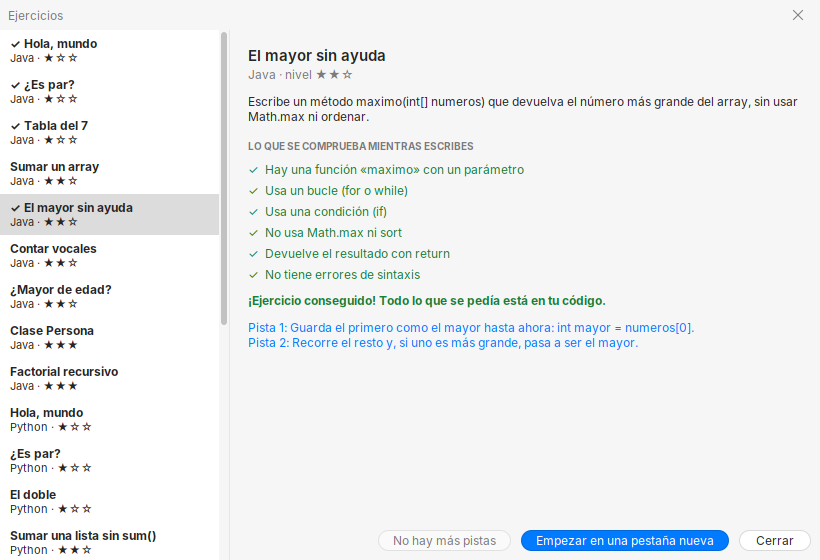

Novedades de la 0.9.0. Todas están en los menús y en la paleta **Ctrl+K**:

1. **Modo ejercicio** (Análisis › Ejercicios…, **Ctrl+Mayús+J**). 23 ejercicios con enunciado (9 de Java, 7 de Python, 2 de JavaScript, 2 de C y 3 de SQL), de una a tres estrellas. **Empezar en una pestaña nueva** abre el código de partida con su lenguaje elegido. La ventana se queda abierta al lado y la lista de lo que se comprueba se marca sola mientras escribes («✓ Hay una función esPar con un parámetro», «✓ Usa el resto de la división», «○ No tiene errores de sintaxis»…). **El código nunca se ejecuta**: Lupa mira cómo está hecho (qué funciones hay, si usa un bucle, qué escribe…), sin contar lo que haya dentro de textos o comentarios. Hay pistas que se enseñan de una en una, y los ejercicios conseguidos llevan ✓ y se recuerdan.
2. **Glosario al pasar el ratón**. Al dejar el ratón sobre una palabra clave (`for`, `static`, `elif`, `SELECT`, `scanf`, `const`…) aparece qué significa en una frase y un ejemplo. Son unas 230 palabras de los cinco lenguajes. Dentro de textos y comentarios no sale, y si en ese punto hay un error subrayado, se ve el error.
3. **Edición cómoda** (menú Editar, con los atajos de IntelliJ):
   - **Ir a la línea** (**Ctrl+G**), también con columna: `25:8`.
   - **Duplicar línea** (**Ctrl+D**), o las líneas seleccionadas. **Subir** y **bajar línea** (**Alt+↑** y **Alt+↓**) y **borrar línea** (**Ctrl+Mayús+Supr**).
   - **Renombrar** (**Mayús+F6**): cambia el nombre de la variable o función que hay bajo el cursor en todo el archivo, sin tocar textos ni comentarios. Avisa si el nombre nuevo no vale, es una palabra reservada o ya existe. Un solo Ctrl+Z lo deshace.
   - **Plegar bloques**: con las flechas del margen, **Ctrl+.** para el bloque del cursor, y **Plegar todo** o **Desplegar todo** (**Ctrl+Mayús+-** y **Ctrl+Mayús++**).
4. **Guardar** (**Ctrl+S**) y **Guardar como…** (**Ctrl+Alt+S**). Hasta ahora Lupa solo abría archivos. Si la pestaña no tiene archivo, propone un nombre con la extensión de su lenguaje.
5. **Formatear solo la selección**: con texto seleccionado, **Ctrl+Alt+L** formatea solo esas líneas. Y la casilla **Editar › Formatear al guardar** formatea el código cada vez que guardas.

973 pruebas en verde (88 nuevas). Cada ejercicio se prueba con una solución de ejemplo, que tiene que cumplirlo todo, y con su código de partida, que no.

### Versión 0.8.1 (métricas, formatear y zoom)

**Novedad de la 0.8.1: zoom del código.** Con **Ctrl + rueda del ratón** sobre el editor, el código se acerca (rueda hacia arriba) o se aleja (hacia abajo), como en IntelliJ o en el navegador. También con **Ctrl++**, **Ctrl+-** y **Ctrl+0** para volver al tamaño normal (menú Ver). Los números de línea crecen a la vez, la línea que estabas viendo se queda arriba, la barra de estado dice el porcentaje y el tamaño se recuerda al volver a abrir Lupa. Va de 8 a 40 puntos y se suma al modo presentación. Sin Ctrl, la rueda desplaza el texto como siempre.

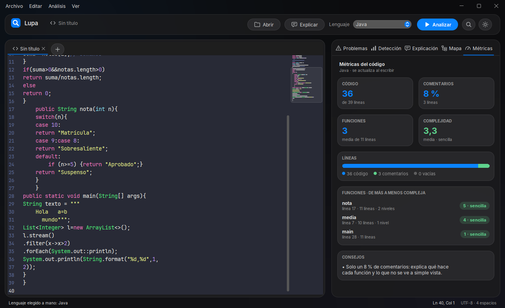

Novedades de la 0.8.0, las dos en los menús y en la paleta **Ctrl+K**:

1. **Métricas del código** (pestaña **Métricas**, **Ctrl+5**). Se actualiza sola medio segundo después de dejar de escribir, como el mapa:
   - Cuatro tarjetas: **líneas de código** (de cuántas en total), **comentarios** (porcentaje y líneas), **funciones** (con su media de líneas) y **complejidad media**, en verde, naranja o rojo según lo difícil que sea de seguir. En SQL salen las **consultas** y las **tablas** creadas en lugar de funciones y complejidad.
   - Una barra con el reparto de líneas: código, comentarios y vacías.
   - Las funciones de la más compleja a la más sencilla, cada una con su línea, su tamaño, su anidación y una pastilla con la complejidad («7 · moderada»). Al pulsar una, el editor salta a ella.
   - **Consejos** en español sobre lo que más conviene mejorar: funciones con demasiados caminos, muy largas, con muchos bloques uno dentro de otro o con muchos parámetros, y si faltan o sobran comentarios.
   - La complejidad es la **ciclomática de McCabe**: 1 más un punto por cada `if`, bucle, `case`, `catch`, `&&`, `||` y `?`. De 1 a 5 es sencilla, de 6 a 10 moderada, de 11 a 20 compleja y más de 20, muy compleja. Lo que hay dentro de textos y comentarios no cuenta.
2. **Formatear código** (Editar › Formatear código o **Ctrl+Alt+L**, el mismo atajo que en IntelliJ). Arregla la sangría y los espacios sin cambiar lo que hace el programa, y un solo **Ctrl+Z** lo deshace. La barra de estado dice cuántas líneas ha cambiado y el cursor se queda donde estaba.
   - **Java, JavaScript y C**: 4 espacios por cada llave, los `case` un nivel más, 8 espacios en lo que continúa dentro de un paréntesis o en una cadena de métodos (`.filter(…)`), espacios alrededor de `=`, `==`, `&&`…, tras las comas y entre `if` y su paréntesis, `) {` y `} else {`. Los genéricos (`List<Map<String, Integer>>`), los `#include` y los punteros (`p->x`) no se tocan.
   - **Python**: 4 espacios por nivel, operadores con espacios pero `f(x=1)` sin ellos, dos espacios antes de un comentario al final de la línea y las líneas en blanco de PEP 8 (dos antes y después de cada función o clase, una entre métodos).
   - **SQL**: palabras clave en mayúsculas, cada cláusula (`FROM`, `WHERE`, `ORDER BY`…) en su línea, `AND`/`OR` sangrados y las columnas de un `CREATE TABLE` con 4 espacios.
   - En todos: sin espacios al final de las líneas, tabuladores pasados a espacios y como mucho una línea en blanco seguida. **Lo que hay dentro de textos, comentarios y bloques de texto no se toca nunca**, y formatear dos veces da lo mismo que una.

881 pruebas en verde (241 nuevas). Entre ellas, todos los fragmentos del banco y las catorce plantillas de inicio se formatean y se comprueba que solo cambian espacios (y las mayúsculas en SQL), que formatear otra vez no cambia nada y que el código Java y Python sigue sin errores de sintaxis.

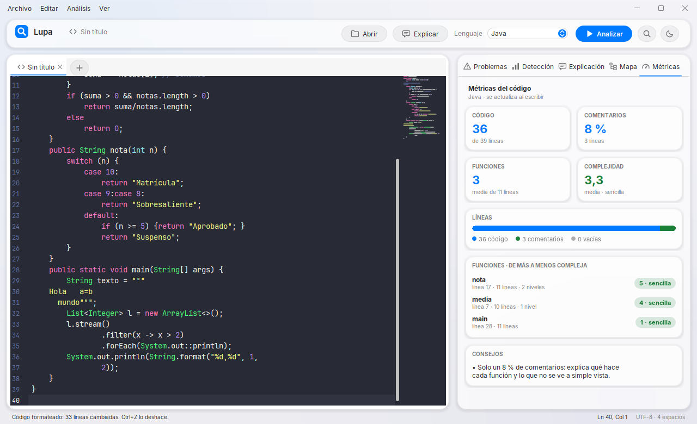

### Versión 0.7.0 (código a partir de un comentario)

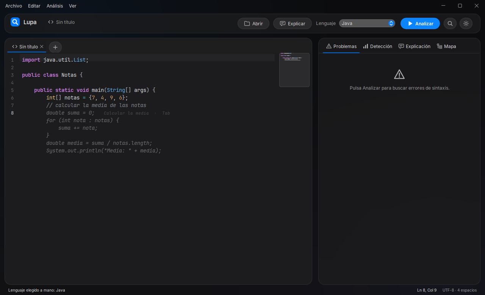

Novedad de la 0.7.0: **autocompletado al estilo Copilot, pero sin IA y sin conexión**. Escribe un comentario con lo que quieres hacer, pulsa **Intro** y Lupa enseña en gris, en cursiva, el código que lo resuelve:

- **Tab** acepta el bloque entero; **Ctrl+→** acepta solo la línea siguiente (para ir línea a línea); **Esc** lo descarta. Si sigues escribiendo, desaparece.
- También salta si llevas el cursor a la línea vacía que hay justo debajo de un comentario.
- Usa los nombres de tu comentario y de tu código: con `int[] notas = {...}` encima, `// calcular la media` recorre `notas` con `nota`; si ya tienes un `Scanner`, lo reutiliza; si dices «la base de datos tienda», conecta a `tienda`.
- Respeta la sangría (espacios o tabuladores) y sabe si estás dentro de un método (escribe el código suelto) o fuera (escribe el método entero).
- Al aceptar, añade arriba las importaciones que falten (`import java.util.Scanner;`, `import random`, `#include <stdio.h>`…), y un solo **Ctrl+Z** lo deshace todo.
- Entiende español y también inglés, con o sin tildes, y verbos conjugados («recorrer», «recorre», «recorremos», «itera», «para cada»…). Si no hay una coincidencia clara, no propone nada.

60 intenciones: Java 50, Python 50, JavaScript 46, C 30 y SQL 10. Están todas en la tabla [Intenciones soportadas](#intenciones-soportadas). 640 pruebas en verde (419 nuevas: cada intención en cada lenguaje, y el código Java y Python que sale se pasa por los analizadores de Lupa para comprobar que no tiene errores de sintaxis).

El motor está detrás de una interfaz, `ProveedorSugerencias`, para que en el futuro se pueda enchufar un proveedor con IA (la ampliación que menciona la Tarea 1) sin tocar el editor.

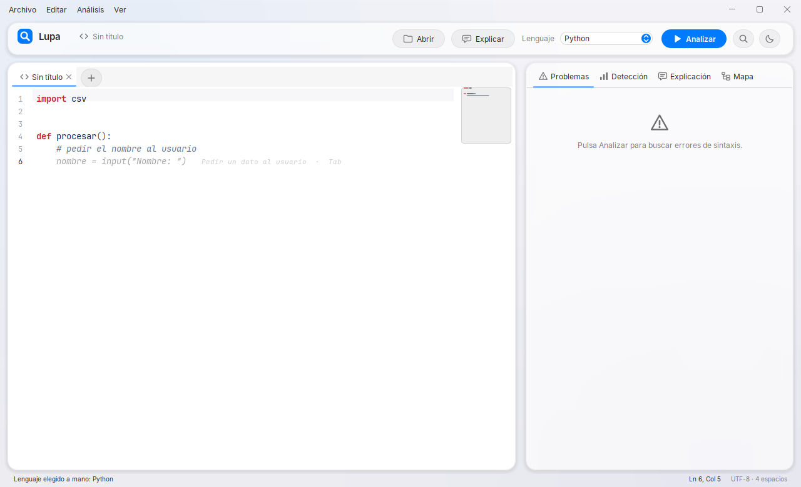

#### Intenciones soportadas

| Intención | Ejemplo de comentario | Java | Python | JS | C | SQL |
|---|---|:-:|:-:|:-:|:-:|:-:|
| Crear una tabla | `crear tabla clientes con nombre y edad` |  |  |  |  | ✓ |
| Borrar una tabla | `borrar la tabla clientes` |  |  |  |  | ✓ |
| Insertar una fila (INSERT) | `insertar un cliente con nombre Ana y edad 30` |  |  |  |  | ✓ |
| Actualizar filas (UPDATE) | `actualizar el precio a 10 en productos donde id = 3` |  |  |  |  | ✓ |
| Borrar filas (DELETE) | `borrar de clientes donde id = 3` |  |  |  |  | ✓ |
| Unir dos tablas (JOIN) | `unir pedidos con clientes` |  |  |  |  | ✓ |
| Agrupar y contar (GROUP BY) | `agrupar clientes por ciudad` |  |  |  |  | ✓ |
| Contar filas (COUNT) | `contar los clientes donde ciudad es Madrid` |  |  |  |  | ✓ |
| Media, suma, máximo o mínimo de una columna | `media de edad de los clientes` |  |  |  |  | ✓ |
| Consultar filas (SELECT … WHERE … ORDER BY) | `select de clientes donde edad > 18` |  |  |  |  | ✓ |
| Hola mundo | `hola mundo` | ✓ | ✓ | ✓ | ✓ |  |
| Mostrar un mensaje entre comillas | `mostrar "Bienvenido"` | ✓ | ✓ | ✓ | ✓ |  |
| Método main / programa principal | `método main` | ✓ | ✓ |  | ✓ |  |
| Conectar a una base de datos | `conectar a la base de datos tienda` | ✓ | ✓ |  |  |  |
| Leer un archivo CSV | `leer el archivo datos.csv` | ✓ | ✓ |  |  |  |
| Leer un archivo de texto línea a línea | `leer un archivo de texto` | ✓ | ✓ | ✓ | ✓ |  |
| Escribir o guardar en un archivo | `guardar el texto en un fichero` | ✓ | ✓ | ✓ | ✓ |  |
| Pedir datos a una API web | `pedir datos a la api` | ✓ | ✓ | ✓ |  |  |
| Pedir un dato al usuario | `pedir un número al usuario` | ✓ | ✓ | ✓ | ✓ |  |
| Menú de opciones | `menú con 3 opciones` | ✓ | ✓ |  |  |  |
| Clase con atributos, constructor, get y set | `crear una clase Persona con nombre y edad` | ✓ | ✓ | ✓ |  |  |
| Función que suma dos números | `función que sume dos números` | ✓ | ✓ | ✓ | ✓ |  |
| Comprobar si un número es primo | `comprobar si es primo` | ✓ | ✓ | ✓ | ✓ |  |
| Factorial | `calcular el factorial` | ✓ | ✓ | ✓ | ✓ |  |
| Serie de Fibonacci | `serie de fibonacci` | ✓ | ✓ | ✓ | ✓ |  |
| Comprobar si un texto es palíndromo | `comprobar si es palíndromo` | ✓ | ✓ | ✓ |  |  |
| Tabla de multiplicar | `tabla de multiplicar del 7` | ✓ | ✓ | ✓ | ✓ |  |
| Comprobar si es mayor de edad | `comprobar si es mayor de edad` | ✓ | ✓ | ✓ | ✓ |  |
| Contar las vocales de un texto | `contar las vocales` | ✓ | ✓ | ✓ |  |  |
| Cuenta atrás | `cuenta atrás desde 10` | ✓ | ✓ | ✓ | ✓ |  |
| Número aleatorio (entre dos valores) | `número aleatorio entre 1 y 6` | ✓ | ✓ | ✓ | ✓ |  |
| Fecha u hora actual | `fecha de hoy` | ✓ | ✓ | ✓ |  |  |
| Esperar unos segundos | `esperar 2 segundos` | ✓ | ✓ | ✓ | ✓ |  |
| Intercambiar dos variables | `intercambiar a y b` | ✓ | ✓ | ✓ | ✓ |  |
| Quitar los repetidos de una lista | `quitar los duplicados de la lista` | ✓ | ✓ | ✓ |  |  |
| Pasar un texto a mayúsculas | `pasar a mayúsculas` | ✓ | ✓ | ✓ |  |  |
| Pasar un texto a minúsculas | `pasar a minúsculas` | ✓ | ✓ | ✓ |  |  |
| Convertir un texto en número | `convertir el texto a número` | ✓ | ✓ | ✓ | ✓ |  |
| Dar la vuelta a un texto | `invertir la cadena` | ✓ | ✓ | ✓ |  |  |
| Dar la vuelta a una lista | `invertir la lista` | ✓ | ✓ | ✓ | ✓ |  |
| Ordenar una lista (de menor a mayor o de mayor a menor) | `ordenar de mayor a menor` | ✓ | ✓ | ✓ | ✓ |  |
| Mostrar, filtrar o contar números pares o impares | `mostrar los números pares del 1 al 20` | ✓ | ✓ | ✓ | ✓ |  |
| Comprobar si un número es par | `comprobar si es par` | ✓ | ✓ | ✓ | ✓ |  |
| Calcular la media | `calcular la media de las notas` | ✓ | ✓ | ✓ | ✓ |  |
| Sumar los elementos (o un rango de números) | `sumar los elementos` | ✓ | ✓ | ✓ | ✓ |  |
| Buscar el máximo | `buscar el máximo de la lista` | ✓ | ✓ | ✓ | ✓ |  |
| Buscar el mínimo | `el mínimo de la lista` | ✓ | ✓ | ✓ | ✓ |  |
| Contar los elementos de una lista | `contar los elementos de la lista` | ✓ | ✓ | ✓ |  |  |
| Buscar un elemento en una lista | `buscar el 5 en la lista` | ✓ | ✓ | ✓ |  |  |
| Recorrer un mapa o diccionario | `recorrer el mapa` | ✓ | ✓ | ✓ |  |  |
| Crear un mapa o diccionario | `crear un diccionario` | ✓ | ✓ | ✓ |  |  |
| Añadir un elemento a una lista | `añadir un elemento a la lista` | ✓ | ✓ | ✓ |  |  |
| Quitar un elemento de una lista | `quitar un elemento de la lista` | ✓ | ✓ | ✓ |  |  |
| Crear una lista | `crear una lista de números` | ✓ | ✓ | ✓ |  |  |
| Recorrer un rango de números (del 1 al 10) | `imprimir los números del 1 al 10` | ✓ | ✓ | ✓ | ✓ |  |
| Repetir algo N veces | `repetir 5 veces` | ✓ | ✓ | ✓ | ✓ |  |
| Recorrer una lista | `recorrer la lista numeros` | ✓ | ✓ | ✓ | ✓ |  |
| Mostrar los elementos de una lista | `mostrar los elementos de la lista` | ✓ | ✓ | ✓ | ✓ |  |
| Capturar errores (try / catch) | `capturar la excepción` | ✓ | ✓ | ✓ |  |  |
| Función o método vacío con su nombre | `función que calcule el área` | ✓ | ✓ | ✓ | ✓ |  |

El comentario no tiene que ser igual que el ejemplo: vale cualquier frase con esas ideas («recorre los alumnos», «iterate over the list names», «imprimir los números del 10 al 1»). Los números, los textos entre comillas, los nombres de archivo (`datos.txt`) y las URL del comentario se copian al código.

### Versión 0.6.0 (diez herramientas nuevas)

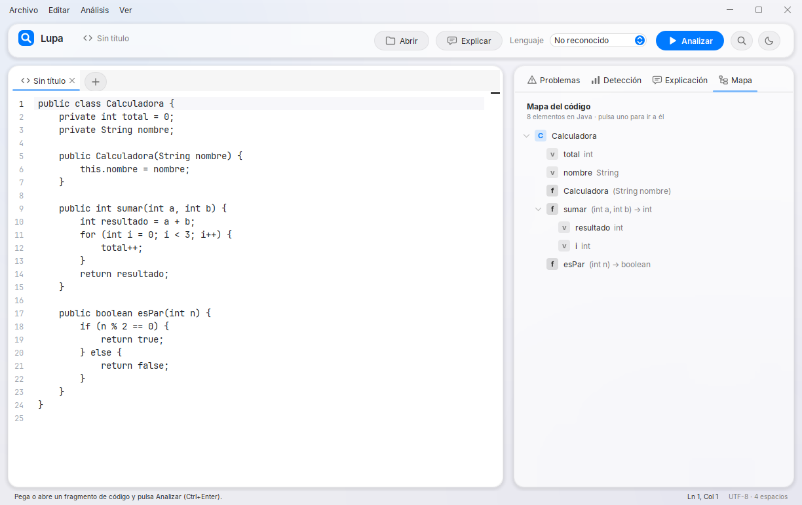

Novedades de la 0.6.0. Todas están en los menús y, por tanto, en la paleta **Ctrl+K**:

1. **Mapa del código** (pestaña **Mapa**, **Ctrl+4**). Árbol con las clases, funciones y variables del código, cada una con una letra (C, f, v, T) y un dato corto en gris (los parámetros, el tipo). Al pulsar una, el editor salta a su línea y la centra. Se actualiza solo medio segundo después de dejar de escribir. En Java usa JavaParser y, si el código tiene errores, reglas; en Python, la sangría; en JavaScript y C, las llaves; en SQL, las tablas con sus columnas.
2. **Diagrama de flujo** (**Ctrl+Mayús+F**, menú Análisis o botón derecho en el editor). Dibuja con Swing la función en la que está el cursor: rombos para los `if` (camino «Sí» a la izquierda y «No» a la derecha) y los bucles (con la flecha que vuelve), rectángulos para las instrucciones y píldoras para el inicio y los `return`. Al pulsar una figura se marca su línea. Se puede dejar abierto al lado, pulsar **Actualizar** tras moverte a otra función y **Guardar imagen…** en PNG.
3. **Minimapa** a la derecha del editor: una miniatura de todo el código con sus colores, el recuadro de lo que se ve, franjas rojas en las líneas con errores (al pasar el ratón se lee el error) y marcas azules donde hay coincidencias de la búsqueda. Pulsa o arrastra sobre él para moverte. Se esconde con **Ctrl+Mayús+M**.
4. **Buscar y reemplazar** (**Ctrl+F** y **Ctrl+H**). Barra encima del editor que resalta todas las coincidencias mientras escribes y cuenta «3 de 12». **Intro/F3** siguiente, **Mayús+Intro/Mayús+F3** anterior, **Esc** cierra. Opciones **Aa** (mayúsculas), **ab** (palabra entera) y **.\*** (expresión regular, con `$1` en el reemplazo). **Todas** reemplaza de una vez y se deshace con un solo Ctrl+Z.
5. **Plantillas de inicio** (**Ctrl+Mayús+N** o Archivo › Plantillas). Catorce programas cortos, correctos y comentados: Hola mundo en los cinco lenguajes, una clase con getters y setters, leer del teclado, un menú con `switch`, un CRUD con JDBC, una clase de Python, leer y validar un número, recorrer un array, la media con `scanf`, un CRUD en SQL y una consulta con JOIN. Se abren en una pestaña con su lenguaje ya elegido.
6. **Pantalla de bienvenida** al estilo de Xcode: logotipo y versión, **Archivo nuevo**, **Abrir…** y **Desde una plantilla**, los archivos recientes (los ocho últimos) y los atajos más útiles. Sale al abrir Lupa (casilla para quitarla) y en Ver › Pantalla de bienvenida.
7. **Mis estadísticas** (**Ctrl+Mayús+S**): errores corregidos, racha de días seguidos (y la mejor), análisis hechos, los errores que más repites en barras y un calendario de las últimas cinco semanas. Se guardan solo en tu equipo, en `.lupa/estadisticas.properties` de tu carpeta personal. Analizar dos veces el mismo código no cuenta doble.
8. **Temas del editor** (Ver › Tema del editor): Lupa (el de siempre), Xcode claro y oscuro, GitHub claro y oscuro, Dracula, One Dark, Monokai y Solarized claro. Se recuerda el elegido. Las pruebas comprueban que el texto de todos se lee bien (contraste WCAG de 4,5 o más).
9. **Exportar como imagen** (**Ctrl+Mayús+I**, menú Archivo). Imagen PNG del código al estilo Carbon: ventana redondeada con tres puntos grises y el nombre del archivo, el código con los colores del editor y un fondo Azul, Grafito, Claro o Transparente. Con o sin números de línea, todo el código o solo la selección. **Guardar PNG…** o **Copiar** para pegarla en cualquier sitio. Sale al doble de tamaño, nítida en cualquier pantalla.
10. **Leer en voz alta** (altavoz en la tarjeta del error o **Ctrl+Mayús+L**). Lee dónde está el error, qué es y su explicación, diciendo los símbolos con palabras («falta punto y coma»). Funciona sin conexión con el sintetizador del sistema: en Windows, PowerShell con System.Speech y la voz en español si está instalada (por ejemplo, Helena); en macOS, `say`; en Linux, `espeak-ng`. Si no hay ninguno, el botón aparece desactivado y lo explica. Vuelve a pulsar para parar.

Mismo estilo iOS limpio: un solo acento azul, sin brillos. 221 pruebas en verde (49 nuevas).

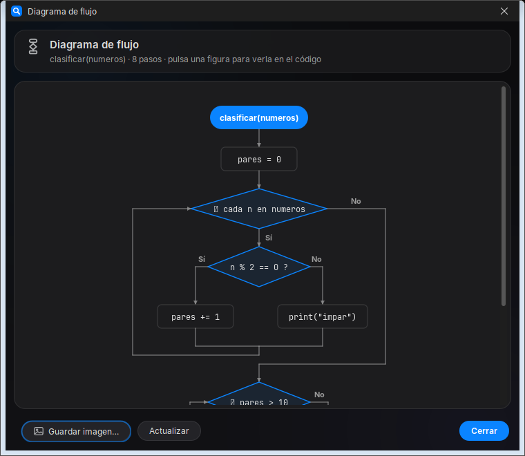

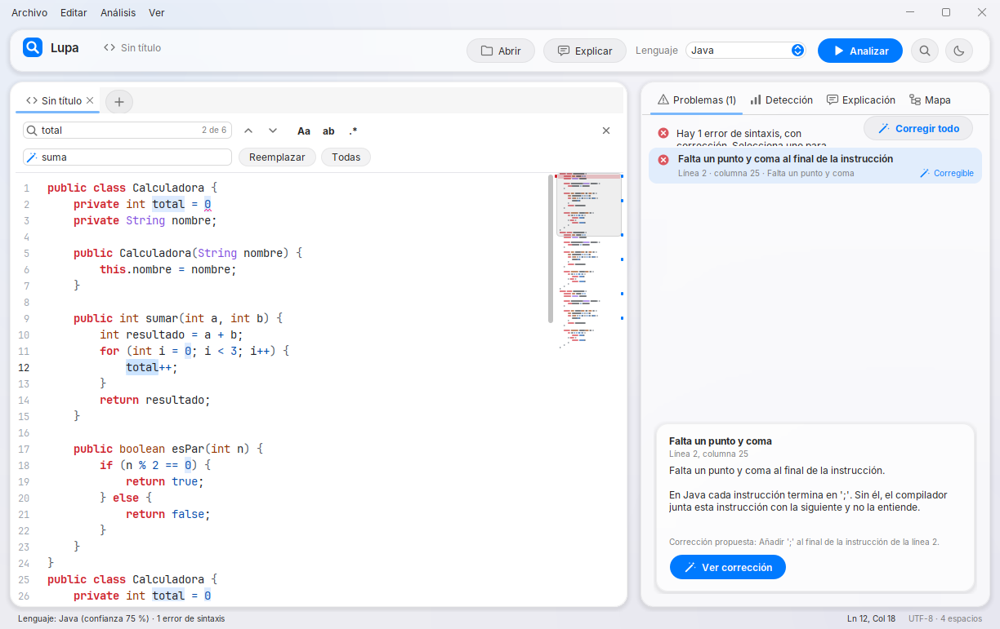

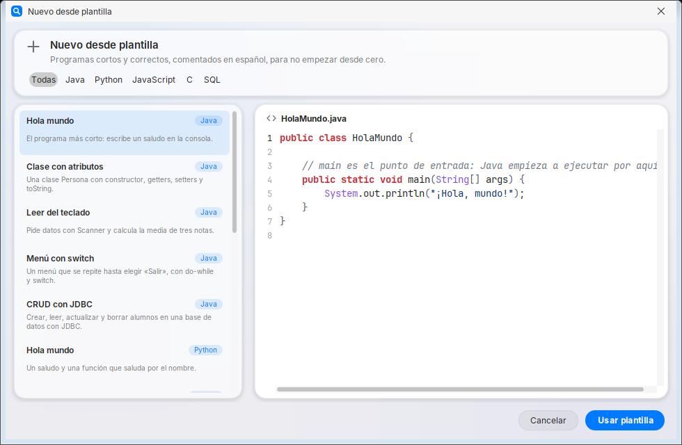

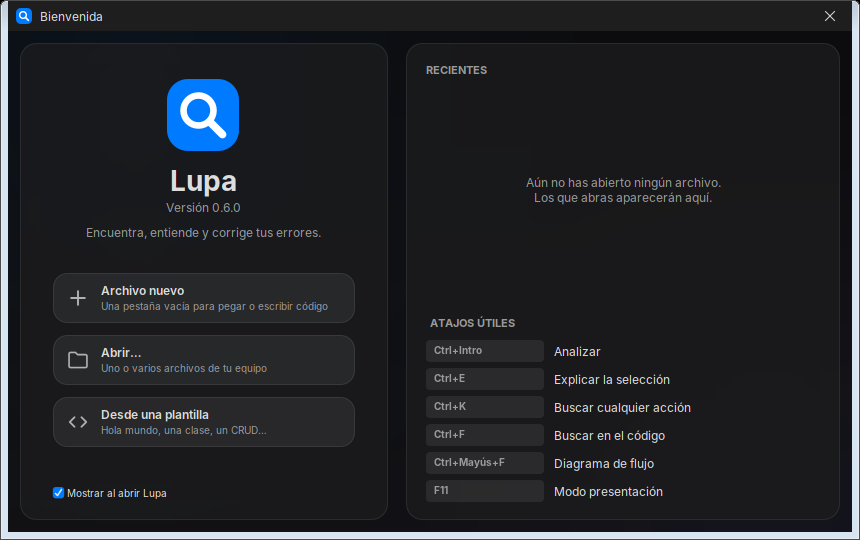

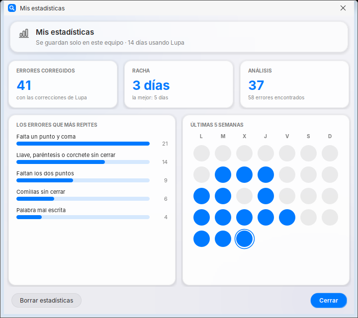

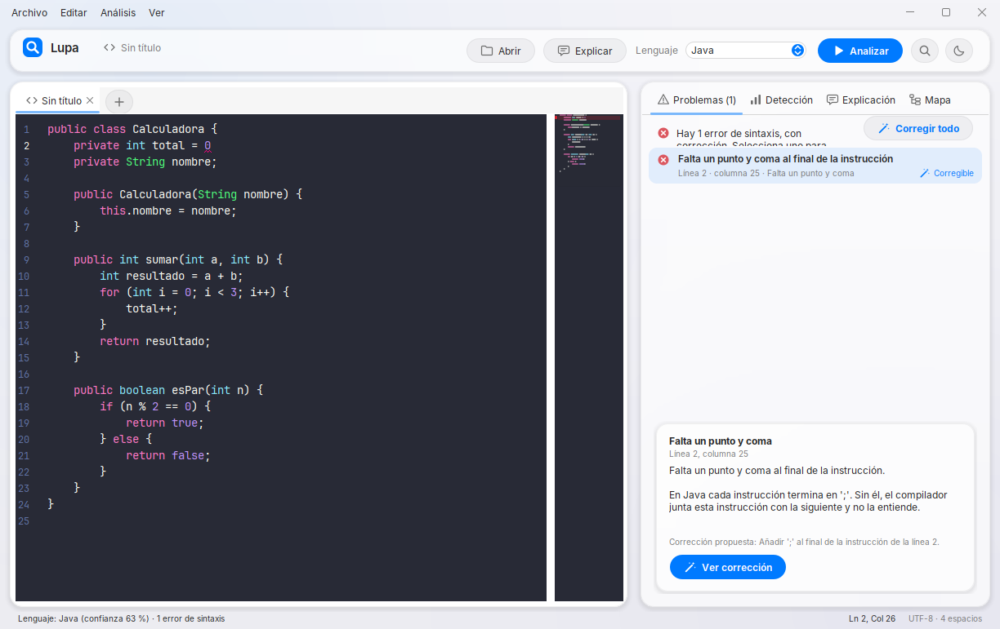

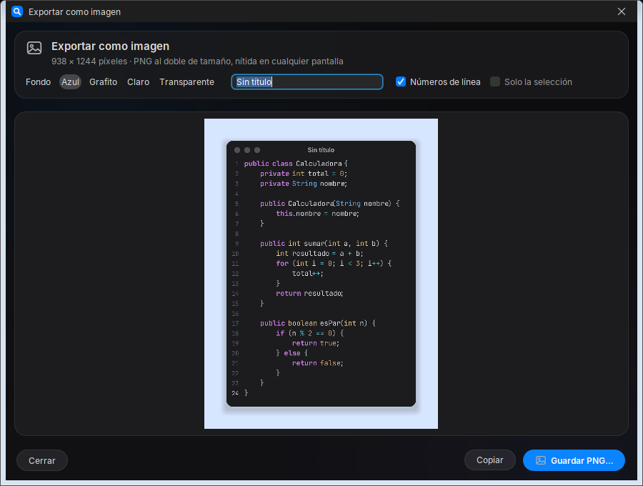

### Versión 0.5.0 (pestañas, arrastrar archivos, comparar versiones y modo presentación)

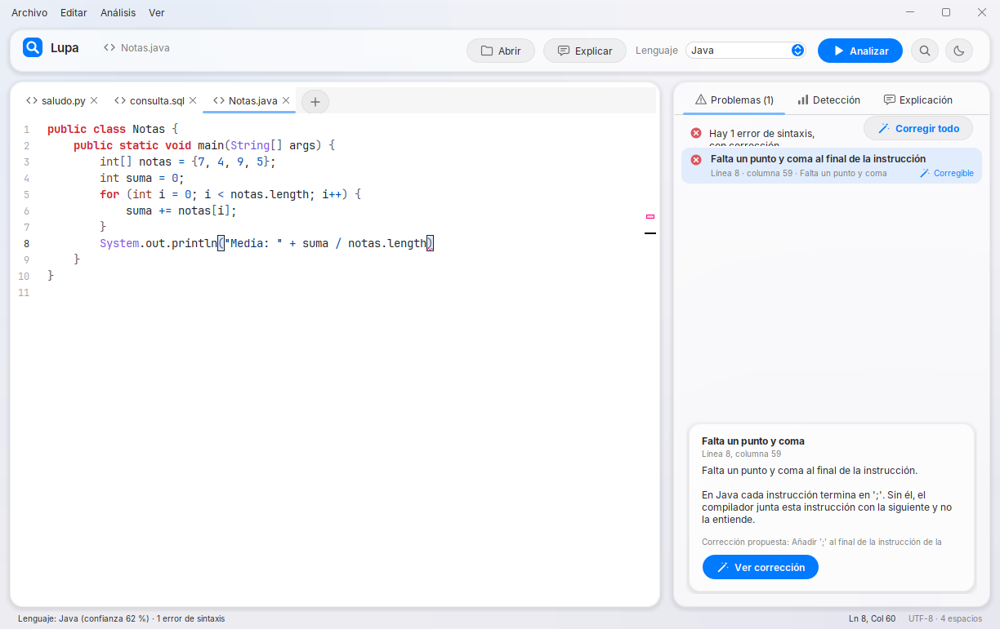

Novedades de la 0.5.0:

- **Pestañas de archivo.** Encima del editor hay una pestaña por archivo abierto. Cada una guarda su propio código, su lenguaje, sus errores, su detección y su explicación: al volver a una pestaña está exactamente como la dejaste. **Ctrl+N** (o el **+**) abre una vacía para pegar código, **Ctrl+W** (o la **×**) la cierra y **Ctrl+Av Pág / Ctrl+Re Pág** pasan a la siguiente o la anterior. Si cierras una pestaña con código cambiado, Lupa pregunta antes (no guarda archivos). Abrir un archivo que ya está abierto no lo duplica: te lleva a su pestaña.
- **Arrastrar y soltar.** Arrastra uno o varios archivos desde el explorador sobre cualquier parte de la ventana: aparece un aviso azul «Suelta para abrir» y cada archivo se abre en su pestaña y se analiza. **Abrir…** (Ctrl+O) también deja elegir varios a la vez. Los archivos que no son de texto, no están en UTF-8 o pasan de 5000 líneas se rechazan con un aviso claro.
- **Comparar dos versiones** (menú Análisis, **Ctrl+Mayús+D** o la paleta). Pon el código viejo a la izquierda y el nuevo a la derecha (pegándolo, con **Abrir…**, con **De una pestaña** o soltando un archivo encima) y pulsa **Comparar** (Ctrl+Intro). Sale la misma vista de cambios que las correcciones, lado a lado, con las líneas añadidas en verde, las quitadas en rojo, las cambiadas en los dos lados con los caracteres exactos resaltados y unas fichas arriba con cuántas hay de cada tipo. **Solo los cambios** esconde las líneas iguales lejanas.
- **Modo presentación** (**F11** o **Ctrl+Mayús+P**, menú Ver o la paleta) para enseñarlo en clase: la ventana se maximiza, toda la letra crece (el código, de 14 a 22 puntos), y la interfaz se queda en lo mínimo: logotipo, archivo, **Explicar**, **Analizar** y **Salir**. Los atajos siguen funcionando igual.
- Todas las acciones nuevas están en los menús y, por tanto, en la paleta **Ctrl+K** (prueba a escribir `comparar`, `proyector` o `cerrar`).
- Mismo estilo iOS limpio: un solo acento azul, sin brillos. 172 pruebas en verde (28 nuevas).

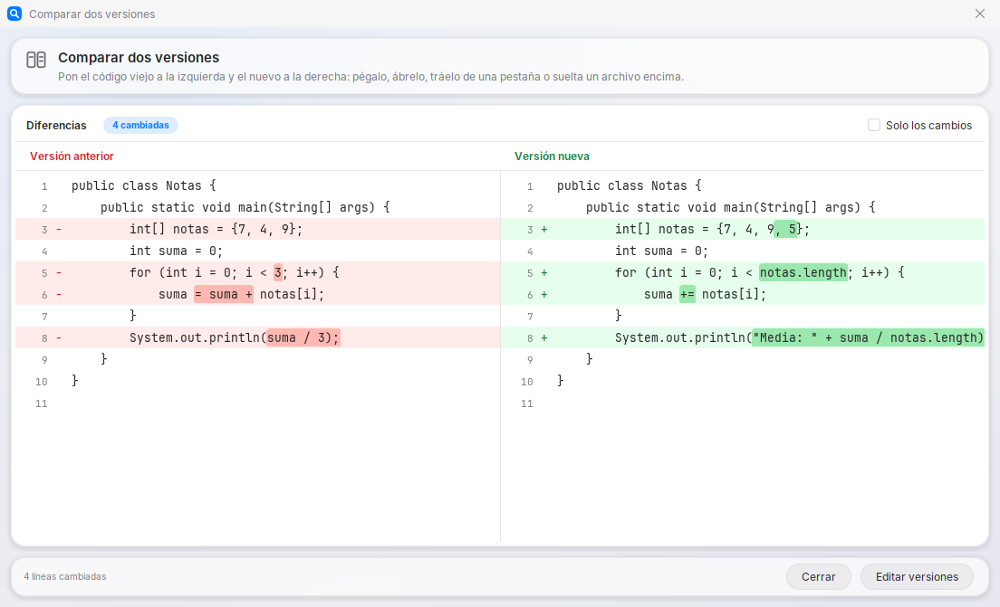

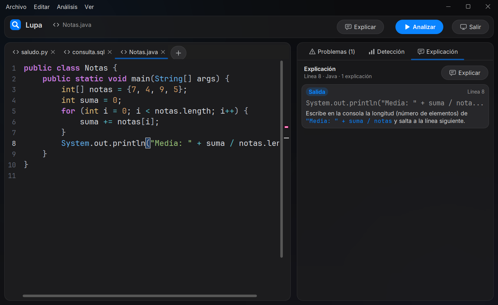

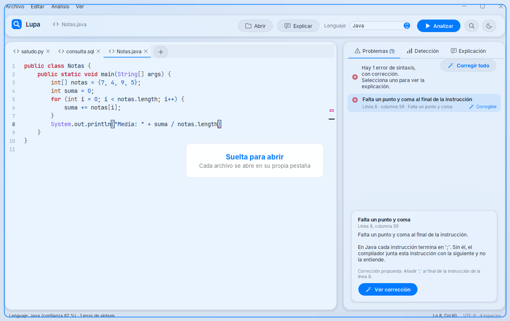

### Versión 0.4.0 (explicación línea a línea y paleta de comandos)

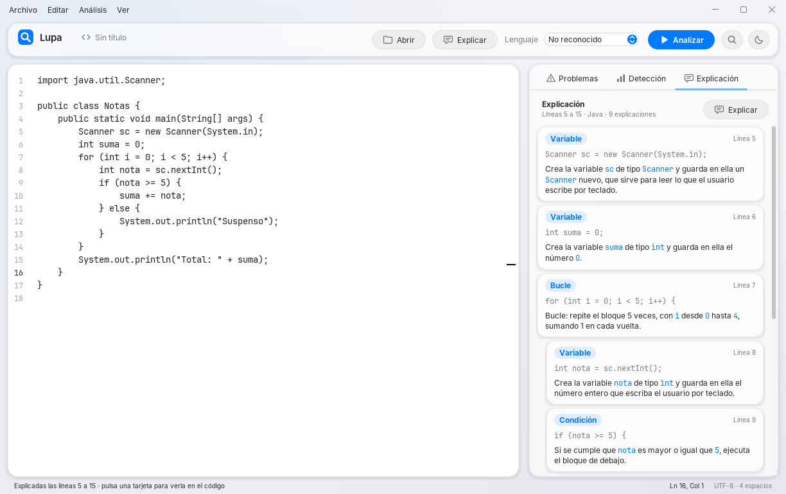

Novedades de la 0.4.0:

- **Explicación línea a línea.** Selecciona un trozo de código (o deja el cursor en una línea) y pulsa **Explicar** (botón de la cabecera, Ctrl+E, menú Análisis o botón derecho en el editor). En la nueva pestaña **Explicación** sale una tarjeta por cada línea o bloque: una etiqueta de qué es (Bucle, Condición, Variable, Función, Llamada, Return…), el código de esa línea y qué hace en español sencillo. Lo que va dentro de un bloque se sangra un poco, y al pulsar una tarjeta se marcan sus líneas en el editor.
- **Sin IA**: cada lenguaje tiene sus reglas. Java usa **JavaParser** (el árbol de sintaxis), así que entiende de verdad los `for`, `if`, `switch`, `try`, métodos, clases, atributos… y traduce las condiciones (`i % 2 == 0` → «`i` es par»). Si el trozo seleccionado está a medias, cierra las llaves que falten y, si aun así no se puede, usa patrones. Python usa reglas y la sangría (`range`, `enumerate`, `input`, `with open`, «crea la variable» la primera vez y «cambia el valor» las siguientes). SQL se explica cláusula a cláusula (SELECT, FROM, WHERE, JOIN, ORDER BY…, columnas de CREATE TABLE y aviso si un UPDATE o DELETE no tiene WHERE). JavaScript y C, con patrones.
- **Paleta de comandos (Ctrl+K)**, al estilo de Spotlight: un buscador flotante centrado que encuentra cualquier acción de la aplicación (analizar, abrir, explicar, corregir todo, cambiar de tema, cambiar de lenguaje, ir a una pestaña…). Filtra al escribir sin importar mayúsculas ni tildes («analisis» encuentra «Análisis»), también por palabras relacionadas («noche» encuentra el tema oscuro) y por iniciales («crt» → «Corregir todo»). Flechas para moverse, Intro para ejecutar, Esc (o clic fuera) para cerrar, y el atajo de cada acción a la derecha de su fila. También se abre con la lupa de la cabecera.
- La paleta saca las acciones de los propios menús, así que nunca se quedan desfasadas. Atajos nuevos: Ctrl+E (explicar), Ctrl+K (paleta), Ctrl+1/2/3 (pestañas), Alt+1…5 (lenguaje: Java, Python, JavaScript, C, SQL) y Ctrl+Q (salir).
- Mismo estilo iOS limpio que la 0.3.2: tarjetas translúcidas, etiquetas en píldora con el azul de acento y nada de brillos.

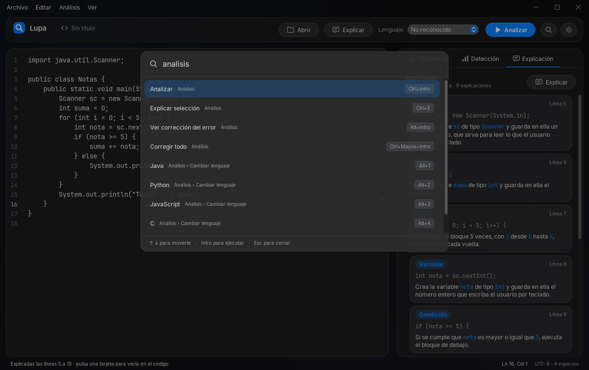

### Versión 0.3.2 (estilo iOS limpio)

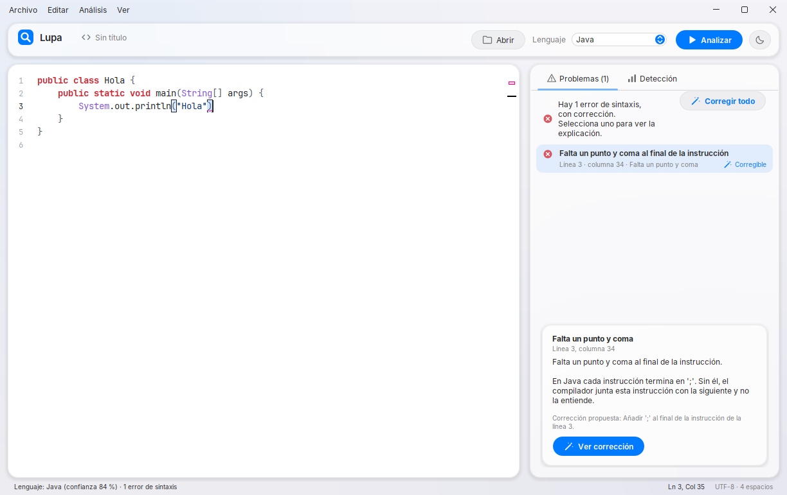

Novedades de la 0.3.2 (solo aspecto, la lógica no cambia). Sustituye al estilo de la 0.3.1, que tenía burbujas, reflejos y brillos y se veía anticuado:

- Estética de iOS y macOS actuales, limpia y minimalista: fondo gris casi plano con un degradado que apenas se nota, mucho espacio y tipografía Inter con jerarquía clara.
- La cabecera, el panel lateral y las tarjetas son **materiales translúcidos** discretos: dejan ver el fondo muy desenfocado, tienen un borde de 1 píxel apenas visible, esquinas redondeadas y una sombra casi imperceptible (solo en el tema claro). Sin reflejos, sin brillos y sin degradados.
- **Es una simulación**: Swing no puede desenfocar de verdad lo que hay detrás, así que Lupa pinta su propio fondo, guarda una copia desenfocada (con `ConvolveOp`) y cada panel pinta el trozo de esa copia que tiene debajo.
- Un único color de acento: el **azul de iOS** (algo más claro en oscuro). También el logotipo y el icono de corregir pasan a azul.
- Botones planos con forma de píldora: **Analizar**, **Ver corrección** y **Aplicar** van rellenos de azul; los demás, con un gris translúcido suave. Al pasar el ratón se aclaran un poco y al pulsarlos se encogen y se atenúan ligeramente, con animaciones cortas.
- El error seleccionado de la lista lleva un fondo azul muy suave, como en las listas de iOS.
- El editor es una hoja lisa (blanca en claro, gris casi negro en oscuro) con esquinas redondeadas, sin desenfoque detrás del código, así que se lee y va igual de rápido. La selección del texto también es azul.
- La barra de estado ya no es un panel: solo texto pequeño sobre el fondo.
- El fondo llega hasta arriba: la barra de título es transparente y los menús y los botones de la ventana quedan sobre el fondo. Donde no hay menús se puede arrastrar la ventana.
- Funciona en los temas claro y oscuro, y la vista de cambios usa el mismo estilo.

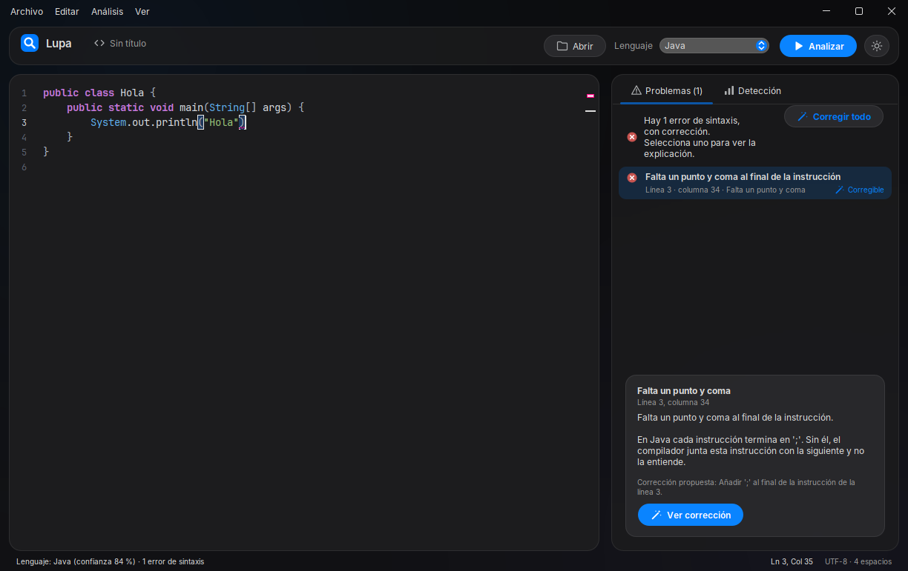

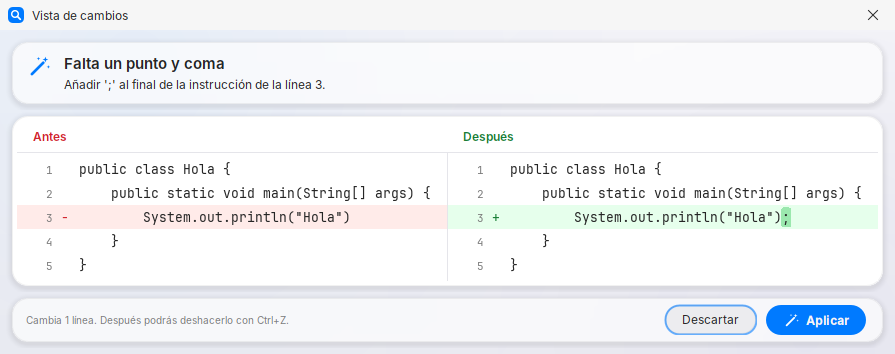

Novedades de la 0.3.0 (RF-04, CU-02):

- Cada error del catálogo que Lupa sabe arreglar lleva la marca **Corregible** en la lista de Problemas. Al seleccionarlo, la tarjeta de explicación dice qué corrección propone.
- **Ver corrección** (botón, doble clic en el error o Alt+Intro) abre la vista de cambios: el código de antes a la izquierda y el de después a la derecha, con las líneas que cambian en rojo y verde y los caracteres exactos resaltados. Si lo que cambia es la sangría, los tabuladores se ven como → y los espacios como ·.
- **Aplicar** cambia el código en el editor como un solo paso, que se deshace con Ctrl+Z (o Editar > Deshacer), y vuelve a analizar. **Descartar** (o Esc) deja el código exactamente igual (RN-03).
- **Corregir todo** (botón encima de la lista o Ctrl+Mayús+Intro) enseña en una sola vista de cambios todas las correcciones y las aplica de una vez; también se deshace con un solo Ctrl+Z.
- Si el código cambia entre el análisis y la corrección, Lupa avisa y vuelve a analizar sin tocar nada (CU-02, A2). Si tras corregir aparece un error nuevo, lo dice y ofrece **Deshacer** (A3).
- Todo el código lleva comentarios en español que explican qué hace cada parte.

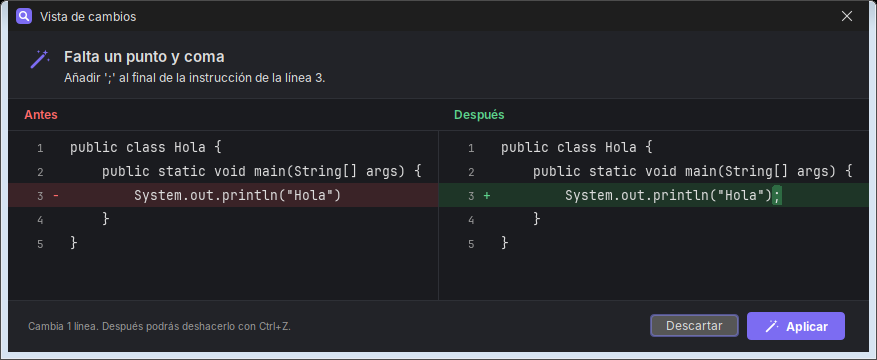

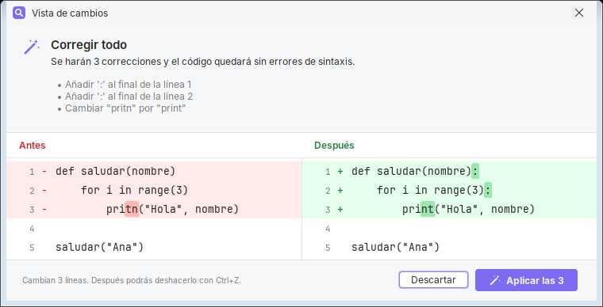

Hecho en versiones anteriores:

- Ventana principal con editor de código (resaltado de sintaxis y números de línea), pestañas de Errores y Detección y barra de estado.
- Interfaz moderna con FlatLaf (v0.2.1): tema oscuro por defecto y claro (menú Ver o Ctrl+Mayús+T, se recuerda), fuentes Inter y JetBrains Mono, iconos SVG, cabecera con las acciones, panel lateral con Problemas y Detección (barras de confianza y pistas) y un tema del editor a juego con cada modo.
- Abrir archivos de texto de hasta 5000 líneas (RF-01).
- Detección del lenguaje (Java, Python, JavaScript, C, SQL) con porcentaje de confianza, pistas que explican el resultado y cambio manual del lenguaje (RF-02).
- Si la confianza es menor del 60 %, la aplicación pregunta entre los dos lenguajes más probables (RN-02). Si no hay pistas suficientes, muestra "No reconocido" (RN-01).
- El análisis se hace fuera del hilo de Swing (SwingWorker). Atajo Ctrl+Enter.
- Pruebas JUnit 5 del detector y banco de 35 fragmentos etiquetados (100 % de acierto).
- Análisis de sintaxis de Java (con JavaParser) y de Python (RF-03). Los errores salen en la pestaña Errores con línea, columna y mensaje en español; al seleccionar uno se explica y se marca en el código. En el editor se subrayan en rojo, el mensaje aparece al pasar el ratón y la franja de la derecha señala las líneas con errores.
- Catálogo cerrado de errores (RN-04), sin IA y sin ejecutar el código. Lo que no está en el catálogo se muestra como "Error de sintaxis" (solo en Java, que usa un analizador completo).
- Pruebas JUnit de cada error del catálogo y comprobación de que los fragmentos correctos del banco no dan errores.
- Autocompletado local mientras se escribe (texto en gris tras el cursor; Tab lo acepta y Esc lo descarta).

## Registro de cambios

Cada cambio guardado en el código de la app (el código es privado; aquí solo se ve qué se hizo y cuándo), del más nuevo al más antiguo. Antes de la 0.11.0 el trabajo no se guardaba en Git, así que esas versiones solo aparecen en el historial de arriba.

- 2026-10-02 · Lupa 0.19.0: efecto de profundidad
- 2026-10-02 · Lupa 0.18.0: aviso de actualizaciones
- 2026-10-02 · Lupa 0.17.0: exportar a PDF
- 2026-10-02 · Lupa 0.16.0: paso a paso en JavaScript y C
- 2026-10-02 · Código privado: la web y las descargas pasan al repositorio público Lupa-App
- 2026-10-02 · Lupa 0.15.0: paso a paso en Java, Python y SQL
- 2026-10-02 · Saltos de línea: .gitattributes con LF y las pruebas que leen archivos convierten \r\n
- 2026-10-02 · Lupa 0.14.0: ejercicios que se comprueban ejecutándolos
- 2026-10-01 · Lupa 0.13.0: análisis de sintaxis de JavaScript, C y SQL
- 2026-10-01 · Lupa 0.12.2: Python incluido, nada que instalar en Windows
- 2026-10-01 · Lupa 0.12.1: C y JavaScript sin instalar nada en Windows
- 2026-10-01 · Web: la 0.12.0 ejecuta los cinco lenguajes
- 2026-10-01 · Lupa 0.12.0: ejecutar JavaScript, C y SQL
- 2026-10-01 · Point the site at the v0.11.0 release instead of build-from-source (#2)
- 2026-10-01 · Add marketing site under site/ and a GitHub Pages deploy workflow (#1)
- 2026-10-01 · Lupa 0.11.0: ejecutar Java y Python en una terminal

## Sobre este repositorio

Aquí están solo la web (carpeta [`site/`](site)) y las descargas. El código fuente de la aplicación es privado.

¿Has encontrado un fallo o echas algo en falta? Cuéntalo en [Issues](https://github.com/pablopozocamp/Lupa-App/issues).

© Lupa. La app se puede descargar y usar gratis. El código y los archivos de la aplicación no se pueden copiar, modificar ni redistribuir sin permiso del autor.
